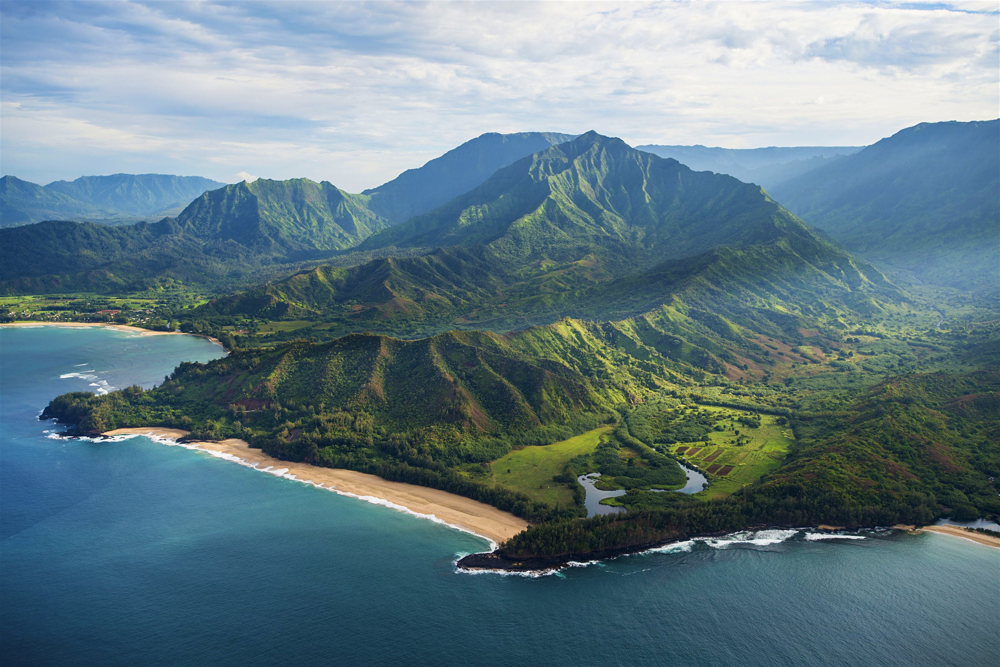

```{r setup, include=FALSE}
knitr::opts_chunk$set(echo = TRUE, message=FALSE, warning=FALSE)
```

Load Packages
```{r}
library(tidyverse)
library(tidyverse)
library(here)
library(janitor)
library(raster)
library(sf)
library(tmap)
library(tmaptools)
library(gstat)
library(plotly)
library(paletteer)
library(ggspatial)
```


The following project will look at the watersheds of the main island of Hawaii. 

The data is from the [Hawaii Statewide GIS Program](http://geoportal.hawaii.gov/datasets/watersheds)



Read in data:
```{r}
water <- read_sf(here("Watersheds", "Watersheds.shp"))
lulc <- read_sf(dsn = here(".", "Land_Use_Land_Cover_LULC"))

```

Plot land use and watersheds in Hawaiian Islands:
```{r}
plot(water)
plot(lulc)
```

Check coordinate reference system:
```{r}
st_crs(water) #EPSG is 4326
st_crs(lulc) #EPSG is 4326
```
#### 2. Tidy data
```{r}
watertidy <- read_sf(dsn = here(".", "Watersheds"),
                 layer = "Watersheds") 

lulctidy <- read_sf(dsn = here(".", "Land_Use_Land_Cover_LULC"),
                layer = "Land_Use_Land_Cover_LULC") %>% 
  filter(landcover == "Mixed Rangeland" |
           landcover == "Shrub and Brush Rangeland" |
           landcover == "Orchards, Groves, Vineyards, Nurseries and Ornamental Horticultural Areas" |
           landcover == "Herbaceous Rangeland" |
           landcover == "Cropland and Pasture" |
           landcover == "Other Agricultural Land") # selecting relevant land covers
```

#### 3. Create an interactive map of the watersheds and land use/land cover for the Hawaiian Islands

```{r, out.width = "100%"}
watershed_tmap <- tm_basemap("Esri.WorldImagery") + # basemap
  tm_shape(watertidy) +
  tm_borders("white", lwd = .75) +
  tm_shape(lulctidy) +
  tm_fill("landcover", 
          title = "Land-Use", 
          palette = c("green", "purple", "blue", "orange"), 
          alpha = 0.5) +
  tm_layout("Land Use/Land Cover Types of Watersheds in Hawaiian Islands") +
  tm_view(view.legend.position = c("left", "bottom"))
tmap_mode("view") # makes map interactive

watershed_tmap
```

This map shows the different land-use and land cover types for different watersheds in the Hawaiian Islands.